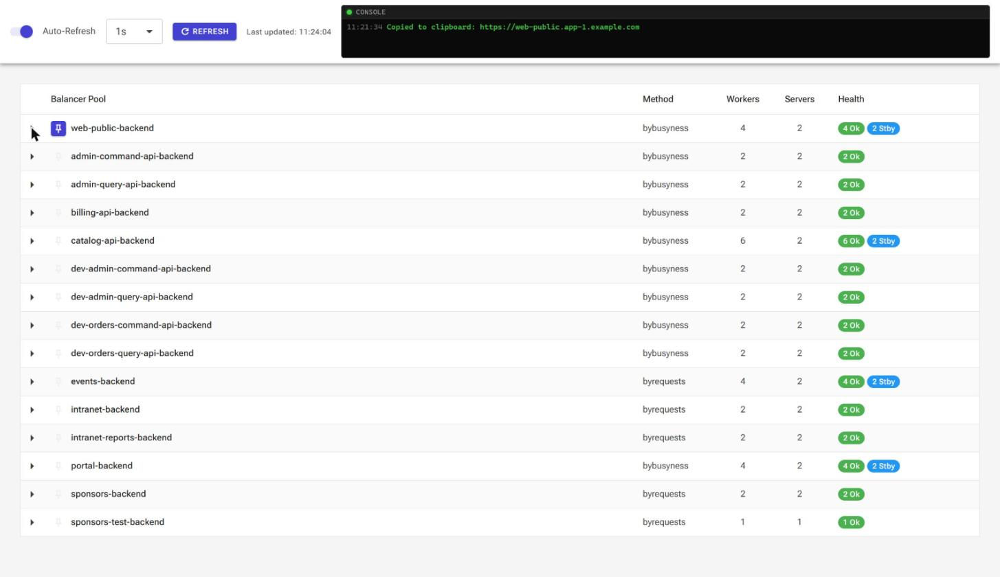
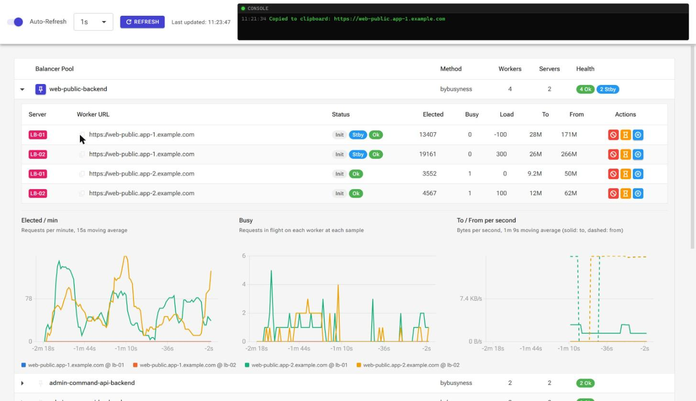
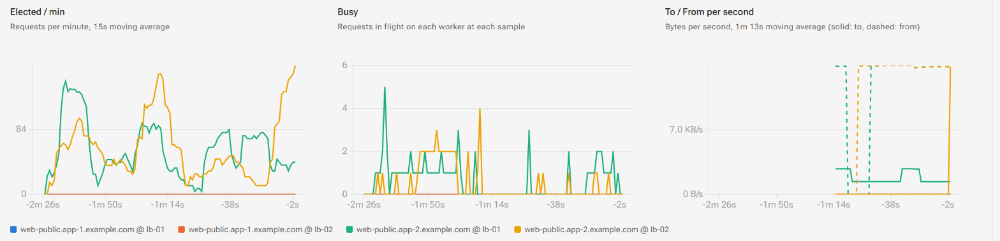
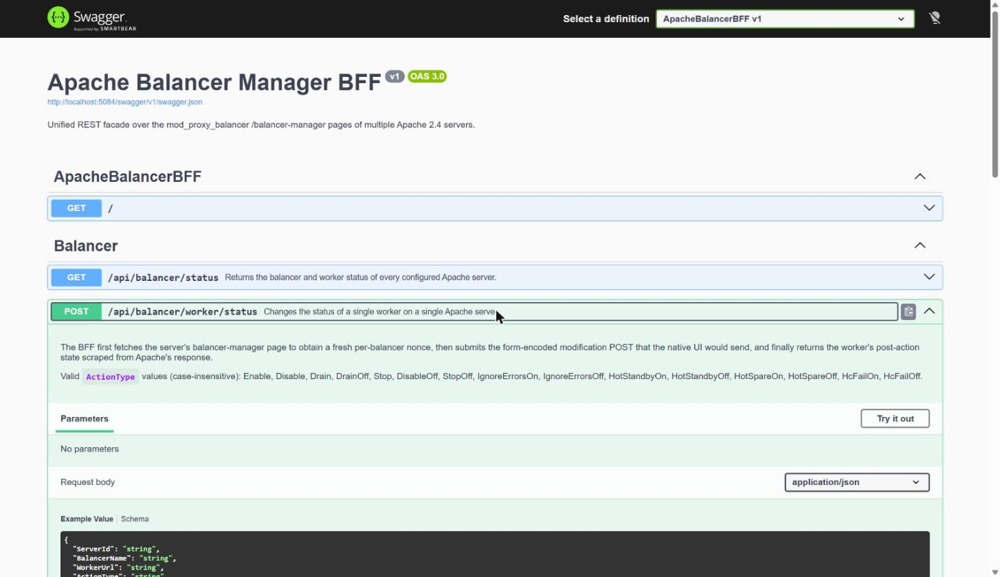

# Apache Balancer Manager

A modern dashboard for the `mod_proxy_balancer` **balancer-manager** pages of one or more Apache HTTPD 2.4 servers.

Apache ships a functional but bare balancer-manager: one page per server, no history, no cross-server view, and a form that answers `HTTP 200` whether or not it actually applied your change. This project puts a single pool-first dashboard in front of all of your Apache instances, with live graphs, one-click worker actions, and a REST API you can automate against.

Nothing is installed on the Apache servers. The backend simply scrapes and drives the same `/balancer-manager` pages you already have.



---

## Contents

- [Why](#why)
- [Features](#features)
- [Screenshots](#screenshots)
- [Architecture](#architecture)
- [Requirements](#requirements)
- [Apache configuration](#apache-configuration)
- [Configuration](#configuration)
- [Running locally](#running-locally)
- [Docker](#docker)
- [Deploying the dashboard](#deploying-the-dashboard)
- [REST API](#rest-api)
- [Security](#security)
- [How it works](#how-it-works)
- [Project layout](#project-layout)
- [Contributing](#contributing)
- [License](#license)

---

## Why

If you run more than one Apache reverse proxy in front of the same backends, the stock balancer-manager makes routine work tedious:

- **One page per server.** Taking a backend out of rotation means repeating the same click on every proxy, in a separate browser tab, and hoping you did not miss one.
- **No history.** The page shows counters, not rates. "Is this worker actually draining?" is a question you answer by reloading and doing arithmetic in your head.
- **Silent failures.** Apache 2.4's cross-site check (`AH10187`) rejects modification requests whose `Referer` is not the manager page — by returning `HTTP 200` and quietly doing nothing.
- **Pool names, not services.** The page is organised by server; when you are draining a backend you think in pools.

This dashboard inverts that: **pools first, servers as a column inside them**, rates instead of raw counters, and every action verified against Apache's own post-action HTML before it is reported as successful.

## Features

- **Pool-first, multi-server view.** Every balancer pool across every configured Apache server on one page, with the same worker on `lb-01` and `lb-02` shown on adjacent rows.
- **Partial success.** An unreachable Apache server is reported in a banner; the reachable ones still render. One dead proxy never blanks the dashboard.
- **One-click worker actions.** Enable/disable, drain, and hot standby, applied per worker per server.
- **Verified actions.** Every change is confirmed against the status flags Apache reports *after* the POST, so a silently-ignored request surfaces as an error instead of a false success.
- **Live graphs per pool.** Expand a pool to get request rate, in-flight requests, and byte throughput per worker, built client-side from the polling history.
- **Adaptive rate windows.** The moving-average windows scale to the history actually on hand, and the captions name the window that was really measured.
- **Auto-refresh at 1s / 3s / 5s / 15s**, with a manual refresh button and a last-updated stamp.
- **Pinned pools.** Pin the pools you watch to the top of the list; pins persist in `localStorage`.
- **On-screen console.** A terminal-style log in the header records every action and its outcome, so you have a trail of what you just did.
- **Copy-to-clipboard worker URLs**, with a fallback for non-HTTPS deployments.
- **Swagger UI** over the whole REST API, for scripting and CI-driven maintenance windows.

## Screenshots

### Pool overview

All pools from every configured server, aggregated, with health badges summarising worker state. Pinned pools float to the top.


### Expanded pool: workers and live graphs

Expanding a pool reveals its workers — the same backend on each Apache server, side by side — and starts three live graphs fed by the auto-refresh.



### Live metrics

Requests per minute, requests in flight, and bytes per second, one coloured line per worker. The graphs start empty when you expand a pool and fill in from there; nothing is stored server-side.



### REST API

The BFF exposes the whole surface through Swagger UI.



## Architecture

```
┌──────────────────────────┐        ┌──────────────────────────┐        ┌────────────────────┐
│  ApacheBalancerWasm      │  JSON  │  ApacheBalancerBFF       │  HTML  │  Apache HTTPD 2.4  │
│  Interface               │ ─────► │  (ASP.NET Core)          │ ─────► │  /balancer-manager │
│  Blazor WebAssembly      │ ◄───── │  scrape + POST + verify  │ ◄───── │  mod_proxy_balancer│
│  + Radzen                │        │                          │        │  (one per server)  │
└──────────────────────────┘        └──────────────────────────┘        └────────────────────┘
        static files                    REST + Swagger                      unmodified
```

- **`ApacheBalancerBFF`** — an ASP.NET Core backend-for-frontend. It fans out over the configured servers concurrently, parses each `/balancer-manager` page with HtmlAgilityPack, and exposes one aggregated JSON contract. It also owns the write path: fetch a fresh nonce, POST the modification, re-parse the response, and confirm the flags actually changed.
- **`ApacheBalancerWasmInterface`** — a Blazor WebAssembly single-page app (Radzen components). It reshapes the BFF's server-first payload into a pool-first tree, keeps a short in-browser history of the worker counters, and draws the graphs. It is a pure static site; it talks only to the BFF.
- **`Shared`** — the DTOs both sides bind to, so the contract cannot drift.

## Requirements

- **.NET 10 SDK** (the projects target `net10.0`).
- **Apache HTTPD 2.4** with `mod_proxy_balancer` and a reachable `/balancer-manager` handler on each server you want to manage.
- Network reachability from wherever the BFF runs to each Apache instance.
- Docker, only if you want to run the BFF as a container.

## Apache configuration

Each managed server needs the balancer-manager handler enabled. A minimal example:

```apache
LoadModule proxy_module            modules/mod_proxy.so
LoadModule proxy_http_module       modules/mod_proxy_http.so
LoadModule proxy_balancer_module   modules/mod_proxy_balancer.so
LoadModule slotmem_shm_module      modules/mod_slotmem_shm.so
LoadModule lbmethod_byrequests_module modules/mod_lbmethod_byrequests.so
LoadModule lbmethod_bybusyness_module modules/mod_lbmethod_bybusyness.so

<Proxy "balancer://web-public-backend">
    BalancerMember "https://web-public.app-1.example.com" hcmethod=GET hcuri=/
    BalancerMember "https://web-public.app-2.example.com" hcmethod=GET hcuri=/
    ProxySet lbmethod=bybusyness
</Proxy>

<Location "/balancer-manager">
    SetHandler balancer-manager
    Require ip 10.0.0.0/24        # the network the BFF runs on — never expose this publicly
</Location>
```

Two things are worth knowing:

- **Restrict `/balancer-manager` by IP.** It is an unauthenticated control surface for your load balancing. Limit it to the management network the BFF runs on.
- **The BFF sends a `Referer` header** matching the manager URL on every request. Apache 2.4's cross-site check (`AH10187`) logs a warning on reads without it, and silently discards writes. No Apache-side configuration is needed for this — it is handled for you.

## Configuration

### BFF — which Apache servers to manage

`ApacheBalancerBFF/appsettings.json`:

```json
{
  "ApacheManagement": {
    "Servers": [
      { "Id": "lb-01", "Name": "Load Balancer Primary",   "BaseUrl": "http://10.0.0.11" },
      { "Id": "lb-02", "Name": "Load Balancer Secondary", "BaseUrl": "http://10.0.0.12" }
    ]
  }
}
```

| Field | Meaning |
| --- | --- |
| `Id` | Stable identifier used by the API and shown as the `Server` badge in the dashboard. |
| `Name` | Human-friendly display name. |
| `BaseUrl` | Base URL of the Apache instance, **without** the `/balancer-manager` path. |

Add as many servers as you like; they are all queried concurrently. In containers you can override any of these with environment variables, e.g. `ApacheManagement__Servers__0__BaseUrl=http://10.0.0.11`.

### Dashboard — where the BFF lives

`ApacheBalancerWasmInterface/wwwroot/appsettings.json`:

```json
{ "BffBaseUrl": "http://localhost:5084" }
```

Environment-specific overrides go in `appsettings.Development.json` / `appsettings.Production.json` next to it. Because this is a WebAssembly app, the file is fetched by the browser at startup — you can edit it in a deployed site without rebuilding.

## Running locally

Run the two projects side by side:

```bash
# Terminal 1 — the BFF (http://localhost:5084, Swagger at /swagger)
dotnet run --project ApacheBalancerBFF

# Terminal 2 — the dashboard (http://localhost:5188)
dotnet run --project ApacheBalancerWasmInterface
```

Then open <http://localhost:5188>. The development profile already points the dashboard at `http://localhost:5084`.

`ApacheBalancerBFF/ApacheBalancerBFF.http` contains ready-made requests for the API if you prefer to start there.

## Docker

The BFF ships with a Dockerfile, and CI publishes an image to GHCR on every push to `main`:

```bash
# Build locally (from the repository root — the Dockerfile expects that context)
docker build -t apache-balancer-bff -f ApacheBalancerBFF/Dockerfile .

docker run -d -p 8080:8080 \
  -e ApacheManagement__Servers__0__Id=lb-01 \
  -e ApacheManagement__Servers__0__Name="Load Balancer Primary" \
  -e ApacheManagement__Servers__0__BaseUrl=http://10.0.0.11 \
  -e ApacheManagement__Servers__1__Id=lb-02 \
  -e ApacheManagement__Servers__1__Name="Load Balancer Secondary" \
  -e ApacheManagement__Servers__1__BaseUrl=http://10.0.0.12 \
  apache-balancer-bff
```

Or pull the published image:

```bash
docker pull ghcr.io/gfk/apachebalancermanager-bff:latest
```

## Deploying the dashboard

The dashboard is a static site — publish it and serve the output with any web server:

```bash
dotnet publish ApacheBalancerWasmInterface -c Release
# output: ApacheBalancerWasmInterface/bin/Release/net10.0/browser-wasm/publish/wwwroot
```

Set `BffBaseUrl` in the published `wwwroot/appsettings.json` to wherever the BFF is reachable from the *browser*, and make sure the host serves the app's `index.html` for unknown paths so client-side routing works.

## REST API

Base path `/api/balancer`. Full interactive documentation is at `/swagger`.

### `GET /api/balancer/status`

Aggregated status of every configured server. All servers are queried concurrently, and the response is **always `HTTP 200`**: unreachable servers land in `Errors` while the rest are returned in `SuccessData`.

```jsonc
{
  "SuccessData": [
    {
      "ServerId": "lb-01",
      "ServerName": "Load Balancer Primary",
      "BaseUrl": "http://10.0.0.11",
      "Balancers": [
        {
          "Name": "web-public-backend",
          "Nonce": "…",
          "Method": "bybusyness",
          "MaxMembers": "2 [2 Used]",
          "StickySession": "(None)",
          "Workers": [
            {
              "Url": "https://web-public.app-1.example.com",
              "RawStatus": "Init Ok",
              "StatusFlags": ["Init", "Ok"],
              "Elected": "13407", "Busy": "0", "Load": "0",
              "To": "28M", "From": "171M",
              "HealthCheckMethod": "GET", "HealthCheckUri": "/"
            }
          ]
        }
      ]
    }
  ],
  "Errors": [
    { "ServerId": "lb-03", "ErrorMessage": "Connection timed out.", "Timestamp": "2026-09-17T15:21:34Z" }
  ]
}
```

Counter cells (`Elected`, `To`, `From`, …) are returned **verbatim, as Apache rendered them** — `"28M"`, not `29360128`. Apache formats them through `apr_strfsize`, and the BFF does not pretend to a precision the source does not have. The dashboard parses them back into numbers for plotting.

### `POST /api/balancer/worker/status`

Applies one state change to one worker on one server.

```json
{
  "ServerId": "lb-01",
  "BalancerName": "web-public-backend",
  "WorkerUrl": "https://web-public.app-1.example.com",
  "ActionType": "Drain"
}
```

`ActionType` is case-insensitive, and one of:

| Action | Effect | Apache field |
| --- | --- | --- |
| `Enable` | Clears Disabled, Drain and Stopped in one call | `w_status_D/N/S=0` |
| `Disable` / `DisableOff` | Sets / clears Disabled | `w_status_D` |
| `Drain` / `DrainOff` | Sets / clears Draining Mode | `w_status_N` |
| `Stop` / `StopOff` | Sets / clears Stopped | `w_status_S` |
| `IgnoreErrorsOn` / `IgnoreErrorsOff` | Sets / clears Ignore Errors | `w_status_I` |
| `HotStandbyOn` / `HotStandbyOff` | Sets / clears Hot Standby | `w_status_H` |
| `HotSpareOn` / `HotSpareOff` | Sets / clears Hot Spare | `w_status_R` |
| `HcFailOn` / `HcFailOff` | Sets / clears the health-check failure flag | `w_status_C` |

Responses:

| Status | Meaning |
| --- | --- |
| `200` | Applied **and verified**. The body carries the worker's post-action state. |
| `400` | Unknown `ServerId`, `BalancerName`, `WorkerUrl` or `ActionType` — the message lists the valid values. |
| `502` | Apache was unreachable, or accepted the request and did not apply it. |

That last case is the important one. Apache answers `HTTP 200` even when it discards a modification, so the BFF re-parses the page Apache returns and compares the worker's status flags against what the action should have produced. A mismatch is reported as a failure with the flags that did not change, rather than a green checkmark over nothing.

## Security

> [!WARNING]
> **The BFF has no authentication or authorization, and its CORS policy accepts any origin.** Anyone who can reach it can disable your backends.

This is deliberate: the service is designed to run inside an isolated management network, in front of `/balancer-manager` endpoints that are themselves IP-restricted. Swagger UI is always enabled for the same reason.

If you deploy it anywhere less controlled, put it behind something that authenticates — a reverse proxy with SSO, an mTLS gateway, a VPN — and tighten the CORS policy in `Program.cs` to the dashboard's origin. Do not expose either the BFF or `/balancer-manager` to the internet.

## How it works

**Reading.** The BFF `GET`s each `/balancer-manager` page concurrently and parses it with HtmlAgilityPack: one `<h3>` per pool carrying the pool name and nonce in its anchor's query string, followed by a summary table and a worker table (11 columns, or 17 when health checks are configured). Apache serves these pages as ISO-8859-1, so the BFF registers the code-pages provider to decode them correctly. A failure on one server is caught per-server and becomes an `Errors` entry.

**Writing.** Modifications need a per-balancer nonce that changes on every page load, so a write is a four-step dance: fetch the page for a fresh nonce, locate the balancer and worker, POST the minimal form payload Apache expects (`b`, `w`, `nonce`, plus the status flags for that action), then re-parse Apache's response and verify the flags. The `Referer` header is set to the manager URL throughout, without which Apache's cross-site check discards the write silently.

**Graphing.** The dashboard keeps up to 120 samples per worker, in the browser, only for the pools you have expanded — roughly two minutes at the 1s refresh, half an hour at 15s. Collapsing a pool throws its history away.

The counters need care. `Elected` is exact, so its per-minute rate is averaged over a short 15-second window. `To`/`From` are not: Apache prints them through `apr_strfsize`, so the displayed value only moves in steps — 1 MB apart in the `161M` band, and about 107 MB apart once a worker crosses 1 GB. A naive two-second delta across one of those steps reads as half a megabyte per second against a true rate two orders of magnitude lower. So the byte rates use a much wider window — half the history on hand, clamped between 1 and 5 minutes — and no point is drawn until that window is genuinely full. The chart captions always name the window that was actually measured, not the one that was asked for.

`Busy` is a gauge rather than a counter, so it is plotted exactly as Apache reported it, on an axis that frames the variation instead of being pinned to zero.

## Project layout

```
ApacheBalancerBFF/              ASP.NET Core BFF
  Configuration/                Server list bound from appsettings
  Controllers/                  REST surface
  Domain/                       Action → Apache form-field mapping and verification
  Services/                     HTTP client, HTML parser, orchestration
ApacheBalancerWasmInterface/    Blazor WebAssembly dashboard
  Components/                   Console window, live pool charts
  Layout/                       Shell and header sections
  Models/                       Pool-first view models, metric samples
  Pages/                        The dashboard
  Services/                     API client, view-model mapper, metrics history
Shared/                         DTOs shared by both projects
```

## Contributing

Issues and pull requests are welcome.

```bash
git clone https://github.com/gfk/ApacheBalancerManager.git
cd ApacheBalancerManager
dotnet build
```

A few notes on the house style, visible throughout the codebase:

- **Explicit types over `var`**, and explicit lambda parameter types.
- **Comments explain *why*, not *what*.** Most of the non-obvious code here exists to work around a specific Apache behaviour; if you add such a workaround, say which one.
- **Keep Apache's output verbatim in the DTOs.** Parsing belongs in the consumer, so the API never implies precision the source lacks.
- If you touch the HTML parser, note which Apache version's layout you tested against.

The screenshots in this README were taken against a live two-proxy cluster; hostnames and pool names in them are placeholders.

## License

[MIT](LICENSE) © Guillaume Filion
